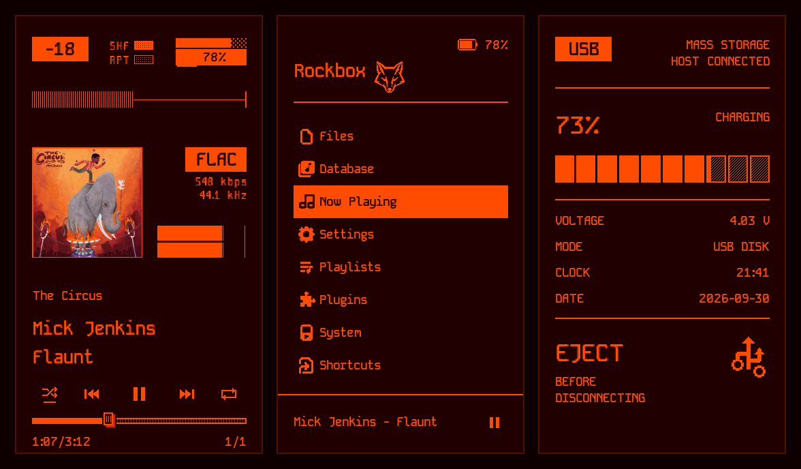

# Snappy AP80 Pro Max

A high-contrast, touch-friendly **Rockbox theme for the Hidizs AP80 Pro Max**, built for its 360 × 640 portrait display. Orange on dark red, KodeMono type, and full Japanese / Unicode metadata support.



> Previews are rendered from the Rockbox simulator at the device's native 360 × 640 resolution.

## Highlights

- **Tactile now-playing controls.** Borderless shuffle / previous / play-pause / next / repeat keys sit above the progress bar.
  - Tap to use them. Hold previous or next to rewind or fast-forward.
  - Shuffle and repeat get an underline marker while active. Repeat shows a small `1` for repeat-one.
  - A pressed key flashes as an inverted block, so every tap gets visible feedback.
- **Touch progress bar.** Tap or drag anywhere on the bar, or on the time row below it, to seek. The knob sinks while you drag.
- **Touch play/pause in the menu footer.** The now-playing strip at the bottom of every menu has a finger-sized play/pause key.
- **Clean peak meter.** The firmware's stray scale dots between the two bars are masked out.
- **Rebuilt USB / charging screen.** It shows battery percentage, a segmented gauge, charging state, voltage, clock and date, plus a large eject reminder.
- **Japanese-ready.** The UI font uses a hybrid KodeMono / Noto Sans CJK set, so Japanese tags render correctly.
- **Theme-colour aware bitmaps.** All 1-bit sprites follow the foreground and background colours in `Snappy.cfg`.

## Install

1. Get the files. Either clone this repository or use **Code → Download ZIP**.
2. Copy the `.rockbox` folder to the root of the player's storage, merging it with the existing `.rockbox` folder.
3. On the player, open **Settings → Theme Settings → Browse Theme Files** and load `Snappy.cfg`.

Only the `.rockbox` folder needs to be on the player. `previews/` and `tools/` are for the repository.

Requirements: a Rockbox build for the Hidizs AP80 Pro Max.

## What's inside

```
.rockbox/
  themes/Snappy.cfg                  theme settings (colours, fonts, iconsets)
  wps/Snappy.wps                     now-playing skin
  wps/Snappy.sbs                     status bar, menu footer, USB screen
  wps/Snappy/                        skin bitmaps (folder name must match the skin files)
  icons/                             menu and viewer iconsets
  fonts/                             KodeMono fonts (+ licence notices)
previews/                            simulator screenshots (360 x 640)
tools/gen_assets.py                  generator for the tactile-control bitmaps
```

## Customising

The touch keys, progress bar, USB gauge and peak-meter mask are generated by a small script. It needs Python and Pillow:

```sh
pip install pillow
python3 tools/gen_assets.py            # borderless keys (default)
python3 tools/gen_assets.py --boxed    # raised, boxed keys
```

The bitmaps are written to `.rockbox/wps/Snappy/`. Colours live in `.rockbox/themes/Snappy.cfg` (`foreground color` / `background color`).

## Credits and licence

- Original **Snappy 1.3** theme by **Christian Soffke**, licensed under **CC BY-SA**. This port and its changes are released under the same licence.
- Fonts: KodeMono and Noto Sans CJK. See `.rockbox/fonts/COPYING-fonts.txt` and `.rockbox/fonts/NotoSansCJK-copyright.txt`.
- Built for the [Rockbox](https://www.rockbox.org) firmware and skin engine.
- The album art in the now-playing preview is *The Circus* by Mick Jenkins. It is shown for illustration only and is not part of the theme.
